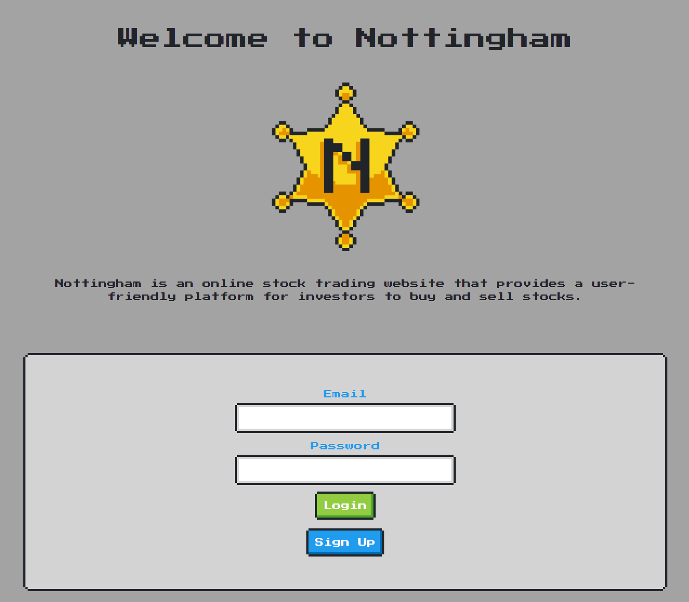

# Nottingham
  ## License:
  MIT   
  ## Table of Contents:
  1. [Description](#description)
  2. [Installation](#installation)
  3. [Usage](#usage)
  4. [Contributors](#Contributors)
  5. [Contributing](#Contributing)
  6. [Tests](#tests)
  7. [Questions](#questions)  
  ## Description:
  Nottingham is an online stock trading website that provides a user-friendly platform for investors to buy and sell stocks.
  &nbsp;  
  
  &nbsp;  
  Deployment Link: https://nottingham.herokuapp.com/
  &nbsp;  
  ## Installation:
  Install the required node packages to use the app by running "npm i" in the command line. Then use "npm start" to start the app.
  &nbsp;  
  ## Usage:
  Begin by signing up or logging in to an existing account. Once logged in the search bar option can be used to search a specific stock that the user may be intrested in. Use the watchlist to keep track of those stocks in an organized database. Buy and sell stocks with the money inside the account, and keep track of how those stocks are doing using the portfolio.
  &nbsp;  
  ## Contributors:
  Nottingham was created by: jnollen23, nicholas4418, chazillaa, vyang9887, yamiralim
  &nbsp;  
  ## Contributing:
  Others can contribute to this project by suggesting new features that could be implemented, as well as notify the team with any bugs that hasn't been caught.
  &nbsp;  
  ## Tests:
  N/A
  &nbsp;  
  ## Questions:
  Questions can be directed to: 
   - https://github.com/jnollen23
   - https://github.com/nicholas4418
   - https://github.com/chazillaa
   - https://github.com/vyang9887
   - https://github.com/yamiralim